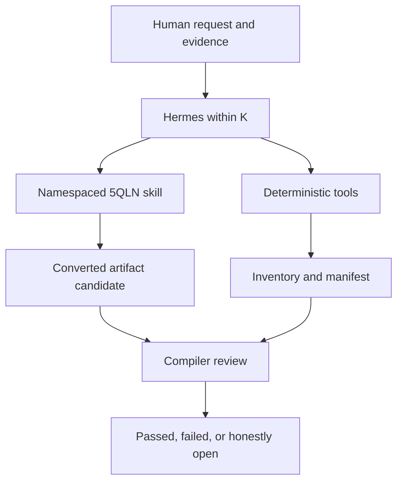

# Architecture

## Contents

1. Design
2. Runtime registration
3. Data flow
4. Trust boundaries
5. Dependency model
6. Portability

## 1. Design

The plugin is hybrid because semantic formation and deterministic validation are different kinds of work.



The skill controls interpretation and composition. The tools make repeatable facts observable: source hashes, counts, required fields, lens orientation, traceability, and completion claims.

## 2. Runtime registration

Hermes discovers the root `plugin.yaml` and imports root `__init__.py`. `register(ctx)` wires:

- three JSON-schema tools under toolset `5qln`;
- the bundled `skills/5qln-converter/SKILL.md` as `5qln:5qln-converter`.

The skill is read-only from Hermes' perspective. Its namespace prevents collision with built-in or user-managed skills.

Tool handlers accept `args: dict`, tolerate future keyword context, catch failures, and always return a JSON string. Subprocesses use the active Hermes Python interpreter and never invoke a shell.

## 3. Data flow

| Stage | Input | Output | Authority |
|---|---|---|---|
| Inventory | Local source files | `source-inventory.json` | Mechanical K-context |
| Scaffold | Source inventory | `conversion-manifest.json` | Exact schema and constitutional constants |
| Formation | Source, human evidence, skill | Converted artifact and completed manifest | Candidate unless explicitly attested |
| Compilation | Completed manifest | `compiler-report.json` | Encoded structural checks only |
| Return | Artifact, report, human recognition | Open, candidate, or recognized return | Human evidence remains decisive |

The manifest is the bridge. It preserves the source ledger and makes semantic claims testable without pretending that syntax is meaning.

## 4. Trust boundaries

### Human boundary

Only explicit human evidence may support `attested` or `human-recognized` states. Model confidence, recursive analysis, agreement, beauty, and compiler success are not substitutes.

### File boundary

The plugin reads paths the caller supplies and writes only the requested output path. Existing outputs are protected unless `overwrite=true` is explicit. Normal operating-system permissions remain in force.

### Execution boundary

The plugin uses bundled Python scripts with argument arrays. It does not use a shell, execute source content, make network requests, or install packages at runtime.

### Validation boundary

The compiler checks the manifest it receives. It does not compare a rendered final document pixel-for-pixel against the source, prove factual truth, or detect every semantic deception.

## 5. Dependency model

Core workflows for Markdown, plain text, RST, logs, CSV, TSV, and JSON use the Python standard library.

DOCX extraction imports `python-docx` only when a DOCX is inventoried. PDF extraction imports `pypdf` only when a PDF is inventoried. Missing optional packages yield a clear tool error rather than changing the workflow silently.

## 6. Portability

The bundled skill retains the original structure:

```text
skills/5qln-converter/
├── SKILL.md
├── agents/openai.yaml
├── references/
│   ├── constitution.md
│   ├── conversion-protocol.md
│   └── manifest.md
└── scripts/
    ├── 5qln_compiler.py
    ├── inventory_source.py
    └── new_manifest.py
```

Hermes uses `SKILL.md`, `references/`, and `scripts/`. The `agents/openai.yaml` file is retained as source metadata and for cross-surface provenance; it is inert in Hermes.

