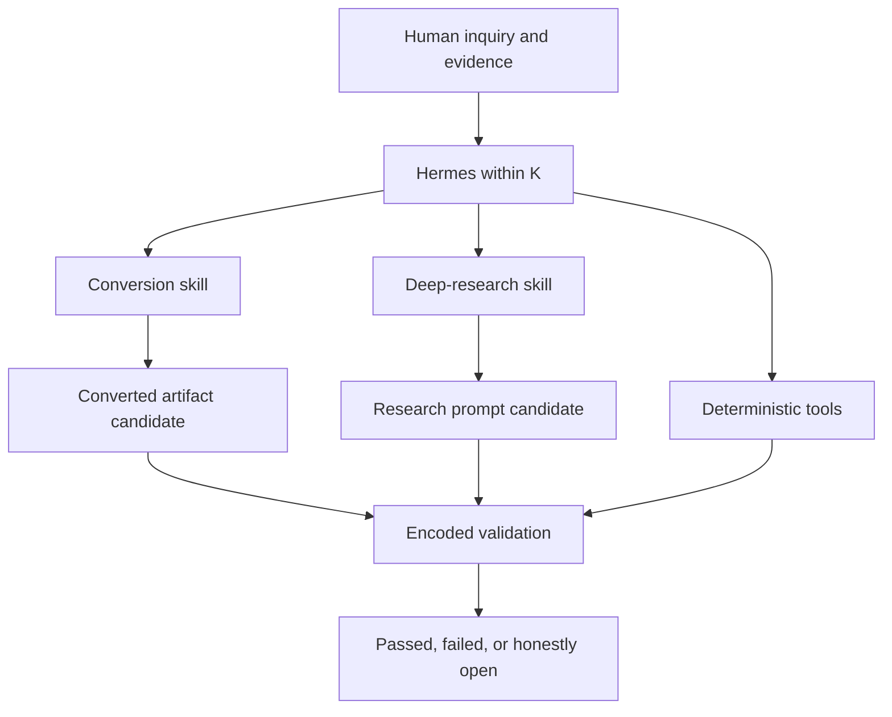

# Architecture

## Contents

1. Design
2. Runtime registration
3. Data flows
4. Trust boundaries
5. Dependency model
6. Portability

## 1. Design

The plugin is hybrid because semantic formation and deterministic validation are different kinds of work.



The skills control interpretation and composition. The tools make repeatable facts observable: source hashes, counts, required fields, lens orientation, traceability, prompt gates, and completion claims.

## 2. Runtime registration

Hermes discovers the root `plugin.yaml` and imports root `__init__.py`. `register(ctx)` wires:

- four JSON-schema tools under toolset `5qln`;
- `skills/5qln-converter/SKILL.md` as `5qln:5qln-converter`;
- `skills/5qln-deep-research/SKILL.md` as `5qln:5qln-deep-research`.

The skills are read-only from Hermes' perspective. Their namespace prevents collisions with built-in or user-managed skills.

Tool handlers accept `args: dict`, tolerate future keyword context, catch failures, and always return a JSON string. Subprocesses use the active Hermes Python interpreter and never invoke a shell. `success` reports execution; `valid` reports the encoded review result.

## 3. Data flows

### Conversion

| Stage | Input | Output | Authority |
|---|---|---|---|
| Inventory | Local source files | `source-inventory.json` | Mechanical K-context |
| Scaffold | Source inventory | `conversion-manifest.json` | Exact schema and constitutional constants |
| Formation | Source, human evidence, conversion skill | Converted artifact and completed manifest | Candidate unless explicitly attested |
| Compilation | Completed manifest | `compiler-report.json` | Encoded structural checks only |
| Return | Artifact, report, human recognition | Open, candidate, or recognized return | Human evidence remains decisive |

The manifest is the bridge. It preserves the source ledger and makes semantic claims testable without pretending that syntax is meaning.

### Deep-research prompt formation

| Stage | Input | Output | Authority |
|---|---|---|---|
| Inquiry hold | Exact human inquiry and constraints | `S_RECORD` contract | H wording preserved; X remains open unless attested |
| Identity growth | Inquiry clauses and α candidate | Subquestions and coverage Y | Derived K-context |
| Evidence design | Prior records and source rules | Evidence, counterevidence, and Q gates | K-context; φ and Z remain human-dependent |
| Adaptive flow | Research branches and constraints | `δE/δV → ∇` path rules | Candidate research movement |
| Prompt composition | Full trace | Standalone prompt or coordinated prompt suite | Candidate B'' with question-bearing return |
| Prompt validation | Saved UTF-8 prompt | JSON validation report | Encoded contract checks only |

The research validator checks one standalone prompt at a time. A suite keeps shared inquiry and α identifiers but validates the coordinator and every specialist prompt separately.

## 4. Trust boundaries

### Human boundary

Only explicit human evidence may support `attested` or `human-recognized` states. Model confidence, recursive analysis, agreement, beauty, compiler success, and prompt-validator success are not substitutes.

### File boundary

The plugin reads paths the caller supplies and writes only the requested output path. Existing outputs are protected unless `overwrite=true` is explicit. Normal operating-system permissions remain in force.

### Execution boundary

The plugin uses bundled Python scripts with argument arrays. It does not use a shell, execute source or prompt content, make network requests, or install packages at runtime.

### Validation boundary

The conversion compiler checks the manifest it receives. It does not compare a rendered final document pixel-for-pixel against the source, prove factual truth, or detect every semantic deception.

The research validator checks exact kernel strings, ordered phase sections, declared provenance and counterevidence rules, flow fields, corruption guards, unresolved template tokens, and question-bearing return. It does not run the research, inspect cited sources, prove that branch choices were wise, or certify resonance or value.

## 5. Dependency model

Core workflows for Markdown, plain text, RST, logs, CSV, TSV, JSON, and research-prompt validation use the Python standard library.

DOCX extraction imports `python-docx` only when a DOCX is inventoried. PDF extraction imports `pypdf` only when a PDF is inventoried. Missing optional packages yield a clear tool error rather than changing the workflow silently.

## 6. Portability

Both bundled skills retain their source structure:

```text
skills/
├── 5qln-converter/
│   ├── SKILL.md
│   ├── agents/openai.yaml
│   ├── references/
│   └── scripts/
└── 5qln-deep-research/
    ├── SKILL.md
    ├── agents/openai.yaml
    ├── references/research-prompt-contract.md
    └── scripts/validate_research_prompt.py
```

Hermes uses `SKILL.md`, `references/`, and scripts exposed through registered tool wrappers. The `agents/openai.yaml` files are retained as source metadata and for cross-surface provenance; Hermes does not consume them.
